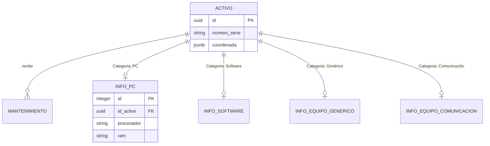
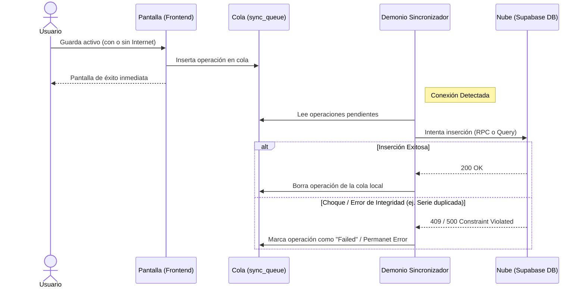

# 📦 Gestor de Inventarios Inteligente (Frontend)

Bienvenido al repositorio oficial del **Sistema de Gestión de Activos Físicos**. Esta aplicación ha sido desarrollada para resolver problemas reales de inventario empresarial, enfocándose en la **robustez offline**, la trazabilidad mediante **geolocalización** y una arquitectura de datos escalable.

---

## 🛠️ Stack Tecnológico y Librerías Core

La aplicación está construida con **Flutter** y utiliza dependencias específicas para interactuar profundamente con el hardware del dispositivo:

*   **Autenticación Biométrica (`local_auth`)**: Permite el desbloqueo de la aplicación mediante Face ID o Huella Dactilar tras el primer login, asegurando acceso rápido sin sacrificar seguridad.
*   **Escaneo Inteligente (`mobile_scanner`)**: Controla la cámara del dispositivo para leer códigos QR y códigos de barras (números de serie), agilizando auditorías.
*   **Geolocalización y Mapeo (`geolocator` & `flutter_map`)**: Captura las coordenadas GPS exactas del dispositivo al momento de registrar un activo y las renderiza en mapas interactivos sin depender de APIs de pago como Google Maps.
*   **Almacenamiento Local (`sqflite` & `flutter_secure_storage`)**: Motor de base de datos local para operaciones offline y bóveda encriptada para tokens de sesión.
*   **Backend as a Service (`supabase_flutter`)**: Sincronización en tiempo real, base de datos PostgreSQL en la nube y sistema de autenticación de usuarios.

---

## 🔐 Autenticación y Sistema de Roles

El sistema implementa un modelo de Control de Acceso Basado en Roles (RBAC) gestionado localmente por el `RoleService` y respaldado por una tabla `usuario_rol` en la nube.

### Recuperación de Contraseña
Se integra un flujo de "Password Recovery" automatizado. Supabase envía un correo con un token seguro (`deep link`). La app escucha el evento `AuthChangeEvent.passwordRecovery` e intercepta el enlace, abriendo directamente la pantalla de reseteo dentro de la aplicación, sin necesidad de usar el navegador web.

### Permisos por Rol
1.  **ADMIN**: Control total. Puede crear/editar activos, realizar mantenimientos, acceder a los ajustes del sistema, y gestionar a otros usuarios (pantalla `admin_users_page`).
2.  **TI (Tecnología)**: Nivel operativo. Puede escanear, crear y editar activos, así como ejecutar y firmar mantenimientos de hardware. No tiene acceso a la administración de usuarios.
3.  **PRESTAMO**: Nivel básico. Únicamente puede consultar el catálogo de activos y editar algunos campos básicos del activo asignado. Tienen bloqueada la visualización y creación de mantenimientos.

---

## 🗄️ Base de Datos y Supabase (Esquema Híbrido)

El diseño de la base de datos se normalizó para separar los metadatos globales del activo de sus características técnicas específicas, permitiendo que la tabla principal sea muy ligera.

### Estructura Relacional (ER-Diagram)

### Funciones RPC (Remote Procedure Calls)
Para evitar el "N+1 query problem" y reducir el consumo de red, se crearon funciones en la nube (ej. `get_activos_completos`). En lugar de que el celular haga 10 consultas para armar un activo con su custodio, marca y área, el RPC ejecuta los `JOIN` en el servidor de PostgreSQL y devuelve un JSON unificado listo para ser clonado en la caché de SQLite.

---

## 📡 Arquitectura de Sincronización Offline-First

El corazón tecnológico del proyecto es el **Demonio Sincronizador (`SyncQueueService`)**. La aplicación NUNCA escribe directamente en la nube. Toda acción del usuario pasa primero por la cola local.

### Diagrama del Flujo de Sincronización

### Mecanismos de Resolución de Conflictos
1.  **"El último que llega gana" (Last Write Wins)**: Como cada activo tiene un UUID, si dos celulares editan el mismo activo estando offline, cuando recuperen la conexión, la nube aceptará la edición del que sincronice al último, sobrescribiendo el estado.
2.  **Los 10 Segundos de Silencio**: Cuando la app sube una cola masiva de cambios a Supabase, la base de datos lanza eventos de confirmación (`Realtime Broadcast`). Para evitar que el celular procese en bucle sus propios ecos de confirmación, la app entra en un "Modo Silencio" de 10 segundos donde ignora los webhooks entrantes hasta estabilizarse.
3.  **Delay de 5 Minutos (Polling)**: Para asegurar que la base de datos local es exacta, la app realiza una descarga total de datos (`get_activos_completos`) cada 5 minutos. Anteriormente se hacía cada 30 segundos, lo que causaba caídas de frames (UI Jank); el ajuste a 5 minutos equilibra la red y la batería.

---

## 🛠️ Bitácora de Ingeniería: Errores Resueltos

Durante el ciclo de desarrollo se aplicaron severas correcciones de arquitectura para llevar el proyecto a estándares de producción. A continuación, los bugs críticos detectados y solucionados:

1.  **[CRÍTICO] Colisión de IDs por Timestamp**: Inicialmente, la cola offline (`enqueueOperation`) usaba `DateTime.now().millisecondsSinceEpoch` como ID principal en SQLite. Si un usuario creaba dos mantenimientos muy rápido, los IDs chocaban y el insert fallaba silenciosamente, perdiendo datos. **Solución**: Migración a `Uuid().v4()` como clave primaria garantizada.
2.  **[CRÍTICO] Bypasseo del Modo Offline en Búsqueda Rápida**: La pantalla `QuickSearchResultPage` eliminaba activos llamando directamente al backend. Si no había internet, la app crasheaba y la base local quedaba desincronizada. **Solución**: Enrutamiento de todas las eliminaciones a través de la cola local (`LocalDbService.instance.enqueueOperation`).
3.  **[CRÍTICO] ANR y Bloqueos en el Arranque (Signal 3)**: Al inicio de sesión, la UI intentaba renderizar SVGs pesados mientras competía por la base de datos local con la sincronización masiva inicial. **Solución**: Migración del Onboarding a PNGs, uso estricto de `cacheWidth` para minimizar el impacto en RAM, y encapsulación de las descargas pesadas en `Future.microtask`.
4.  **[ALTO] Refactorización de Duplicación de Código**: Las 4 páginas de subcategorías de activos (PC, Software, etc.) compartían un 75% de código, dificultando el mantenimiento. **Solución**: Creación de clases abstractas, centralización de variables inmutables para filtros y estandarización del `AssetDataTable`.
5.  **[MEDIO] Actualizaciones Optimistas (DELETE vs UPSERT)**: Al recargar datos, la app borraba la tabla entera (`DELETE`) para re-insertarla, causando pestañeos (flickering) en la interfaz. **Solución**: Implementación de `ConflictAlgorithm.replace` (Upsert) nativo de SQLite para inyecciones limpias de datos sin vaciar la caché.

---

## 📖 Tutorial Integrado (Onboarding)
Se implementó un flujo explicativo de "Día Cero". El sistema lee la base de datos local `cache_storage` para detectar el flag `has_seen_onboarding`. La primera vez que un empleado inicia sesión, se le enseña cómo usar la categorización de activos y el escáner de códigos QR. Luego, el tutorial puede reabrirse desde el menú lateral en cualquier momento.

---
*Documentación técnica del Sistema de Inventarios Offline-First — Proyecto Integrador 2026*
