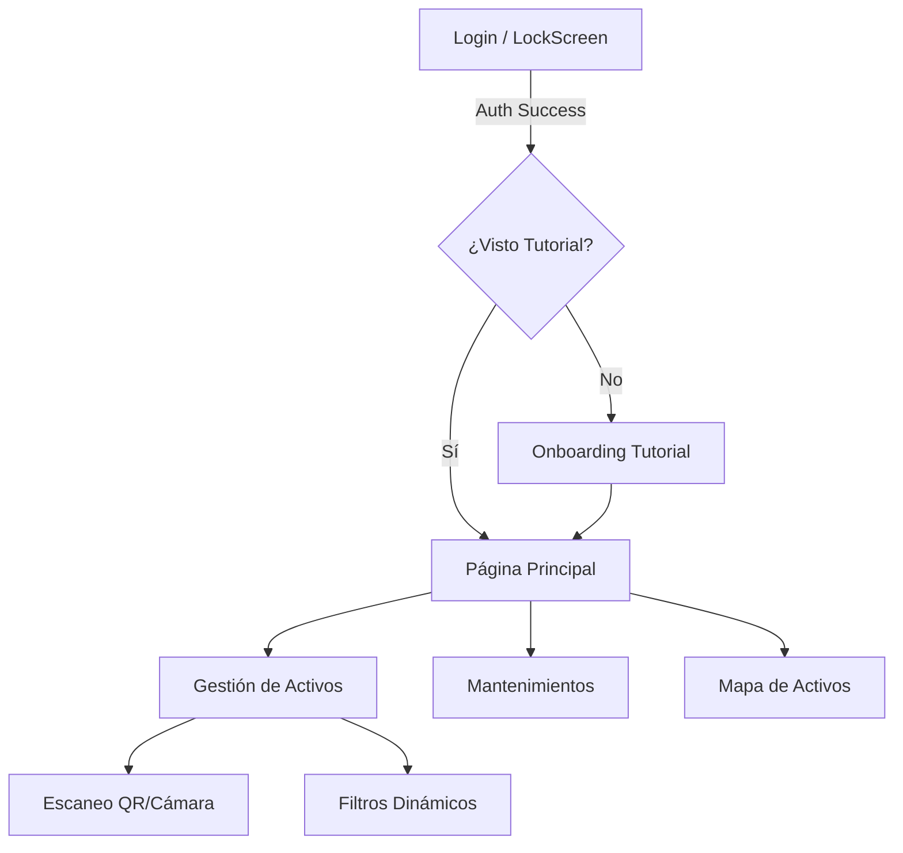
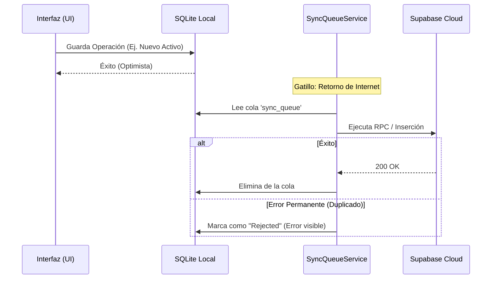
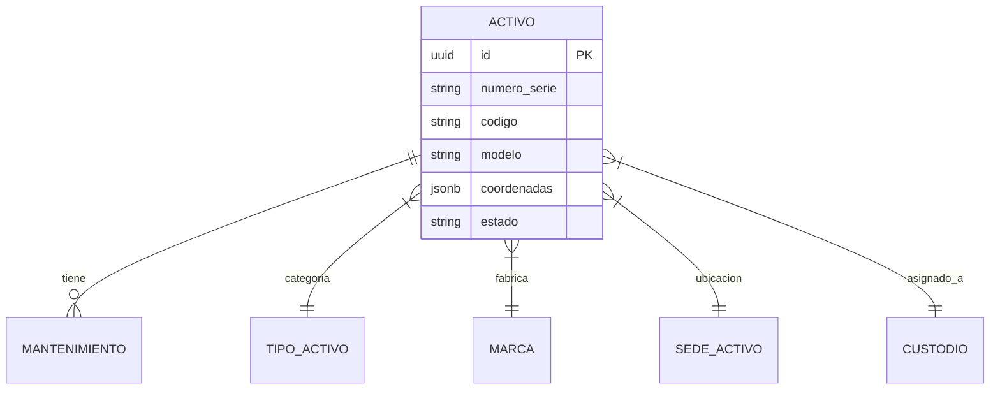

# 📦 Gestor de Inventarios Inteligente (Frontend)

Bienvenido al repositorio oficial del **Sistema de Gestión de Activos Físicos**. Esta aplicación ha sido desarrollada como parte del proyecto integrador, enfocándose en la robustez offline, la geolocalización de activos y la eficiencia técnica en la gestión de hardware y software empresarial.

---

## 🚀 Guía de Inicio Rápido

### Requisitos Previos
*   [Flutter SDK](https://docs.flutter.dev/get-started/install) (Versión 3.19 o superior recomendada).
*   Un proyecto activo en [Supabase](https://supabase.com/).
*   Dispositivo Android físico (Recomendado para pruebas de Cámara y GPS).

### Instalación
1.  Clona este repositorio:
    ```bash
    git clone https://github.com/tu-usuario/front_inventarios.git
    ```
2.  Instala las dependencias:
    ```bash
    flutter pub get
    ```
3.  Configura el archivo `.env` en la raíz del proyecto:
    ```env
    SUPABASE_URL=tu_url_de_supabase
    SUPABASE_ANON_KEY=tu_anon_key
    ```
4.  Ejecuta la aplicación:
    ```bash
    flutter run
    ```

---

## 🏗️ Arquitectura del Sistema

La aplicación utiliza una arquitectura **Híbrida Online/Offline**, donde la fuente de verdad es Supabase, pero la operatividad diaria reside en una base de datos local SQLite.

### Estructura de Navegación


### Sincronización Offline (The Sync Queue)
El sistema utiliza un **Demonio Sincronizador** (`SyncQueueService`) que vigila la conectividad y gestiona una cola de operaciones pendientes.



---

## 🛠️ Tecnologías y Funciones Críticas

### 📸 Escaneo de Activos (Cámara)
Implementado mediante `mobile_scanner`. Permite la identificación instantánea de equipos mediante la lectura de códigos QR o etiquetas de serie, eliminando el error humano en la búsqueda de inventario.

### 📍 Localización y Mapas (GPS)
Uso de `geolocator` y `flutter_map`. Cada activo puede ser georeferenciado al momento de su creación o edición, permitiendo visualizar la ubicación exacta de los equipos en un mapa interactivo.

### 🔐 Autenticación y Seguridad
*   **Roles Dinámicos**: Acceso restringido (ADMIN, TI, PRESTAMO) gestionado vía `RoleService`.
*   **Recuperación de Contraseña**: Flujo integrado con envío de correo electrónico desde Supabase y redirección (`deep linking`) a la app para el cambio de clave.
*   **Pantalla de Bloqueo**: Validación de hash local para acceso rápido sin necesidad de re-autenticarse en el servidor constantemente.

### 📡 Sincronización mediante Broadcast (Realtime)
La aplicación escucha los cambios en Supabase en tiempo real. Para evitar bucles infinitos ("ruido"), se implementó un **Periodo de Silencio de 10s** después de cada sincronización masiva, garantizando la integridad de los datos.

---

## 🗄️ Base de Datos y Modelo de Datos

### Estructura de Datos (Entity-Relationship)


### Funciones RPC (Remote Procedure Calls)
Se utilizan RPCs para operaciones complejas que requieren lógica de servidor, como `get_activos_completos`, que realiza joins multizona para entregar un modelo de datos optimizado para la caché local.

### Base de Datos Local (SQLite)
*   **`cache_storage`**: Almacena documentos JSON de cada tabla para acceso instantáneo.
*   **`sync_queue`**: Almacena las operaciones que aún no se han subido a la nube.

---

## 🧪 Control de Calidad y Solución de Problemas

### Tests Unitarios Realizados
*   **`asset_filter_test.dart`**: Validación de la lógica de búsqueda y filtrado multivariable.
*   **`local_db_service_test.dart`**: Pruebas de integridad en las inserciones y borrados de la caché.
*   **`rpc_test.dart`**: Simulación de llamadas a funciones remotas.

### Desafíos Técnicos Superados
1.  **Resolución de ANR (Signal 3)**: Se detectó que la carga masiva de imágenes SVG bloqueaba el hilo principal en dispositivos Android. **Solución**: Migración de activos a PNG de alta resolución y uso de `cacheWidth: 400` para reducir el consumo de RAM en un 80%.
2.  **Deadlocks de Base de Datos**: Durante el arranque, la sincronización y la UI competían por la DB. **Solución**: Implementación de `Future.microtask` y `timeout(2s)` en las consultas de arranque para evitar colgados del sistema.

---

## 💡 El Tutorial (Onboarding)
Se diseñó un flujo de bienvenida interactivo que explica las 4 categorías clave y el uso del escaneo. Este tutorial solo aparece en el primer inicio de sesión del usuario y puede ser revisitado desde el menú lateral en la sección **"Ayuda / Tutorial"**.

---
*Desarrollado con ❤️ para el Proyecto Integrador 2026.*
