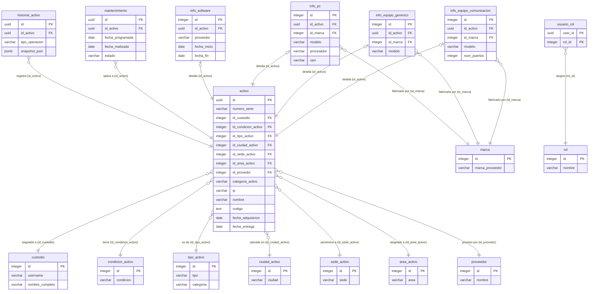
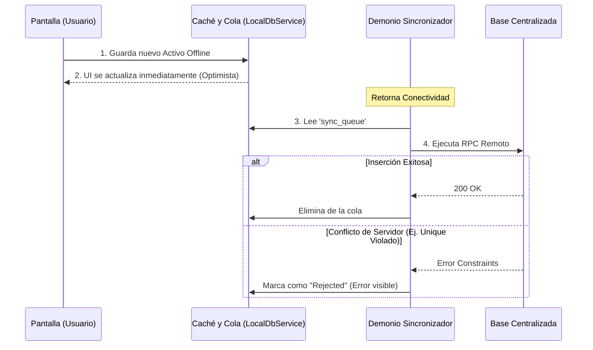

# 📦 Gestor de Inventarios Inteligente (Frontend)

Bienvenido al repositorio oficial del **Sistema de Gestión de Activos Físicos**. Esta aplicación ha sido desarrollada como parte del proyecto integrador, enfocándose en la robustez offline, la geolocalización de activos y la eficiencia técnica en la gestión de hardware y software empresarial.

---

## 🚀 Guía de Inicio Rápido

### Requisitos Previos
*   [Flutter SDK](https://docs.flutter.dev/get-started/install) (Versión 3.19 o superior recomendada).
*   Un proyecto activo en [Supabase](https://supabase.com/).
*   Dispositivo Android físico (Recomendado para pruebas de Cámara, Biometría y GPS).

### Instalación
1.  Clona este repositorio:
    ```bash
    git clone https://github.com/tu-usuario/front_inventarios.git
    ```
2.  Instala las dependencias:
    ```bash
    flutter pub get
    ```
3.  Configura el archivo `.env` en la raíz del proyecto (Nunca subas este archivo a repositorios públicos):
    ```env
    SUPABASE_URL=tu_url_de_supabase
    SUPABASE_ANON_KEY=tu_anon_key
    ```
4.  Ejecuta la aplicación:
    ```bash
    flutter run --release
    ```

---

## 🛠️ Tecnologías y Módulos Críticos

### 🔐 Autenticación y Seguridad Multinivel
*   **Biometría y Pantalla de Bloqueo**: Uso de `local_auth` para integración con **Face ID y Huella Dactilar** del dispositivo. El sistema guarda un hash local de la sesión, permitiendo desbloqueos ultrarrápidos sin tener que ir a consultar a Supabase cada vez que la app pasa a segundo plano.
*   **Sistema de Recuperación (`Deep Linking`)**: Si un usuario olvida su clave, Supabase envía un email mágico. Al hacer clic, la librería `supabase_flutter` intercepta la URL y abre directamente la `PasswordResetPage` dentro de la app móvil.
*   **Control de Roles Basado en RBAC (Role-Based Access Control)**:
    *   **`ADMIN`**: Acceso total. Puede ver/gestionar el estado de los equipos, crear usuarios y asignar roles.
    *   **`TI`**: Acceso operativo. Puede crear y editar activos, además de programar y marcar mantenimientos como completados.
    *   **`PRESTAMO`**: Acceso de solo lectura/edición superficial. Puede ver detalles, pero se le oculta el panel de creación de mantenimientos y la vista de administración.

### 📸 Escaneo QR y 📍 Mapas GPS
*   **Inventariado Veloz**: A través de `mobile_scanner`, la cámara escanea directamente números de serie o códigos QR, saltando a la vista de detalles sin requerir búsqueda manual.
*   **Georeferenciación**: Integración de `geolocator` para obtener las coordenadas exactas del teléfono al momento de registrar un activo y visualización en tiempo real usando `flutter_map` (mapas interactivos basados en OpenStreetMap).

### 💡 Tutorial de Onboarding
Flujo educativo que se muestra **solo la primera vez** tras el registro usando validación por bandera local (`has_seen_onboarding` en SQLite). Diseñado con imágenes PNG optimizadas (usando `cacheWidth`) para garantizar cero impacto en la RAM del teléfono (evitando los bloqueos ANR que provocaba el renderizado vectorial pesado).

---

## 🗄️ Arquitectura de Base de Datos (Supabase)

El modelo de datos emplea un patrón **polimórfico**. Existe una tabla núcleo (`activo`) que almacena las características universales (serie, ubicación, custodia) y múltiples tablas satélite (`info_pc`, `info_comunicacion`, etc.) que almacenan metadatos específicos según la categoría.



### Funciones RPC (Remote Procedure Calls)
Para evitar que el celular tenga que procesar millones de registros mediante múltiples consultas, delegamos la carga al servidor con **RPCs** como `get_activos_completos`. Estas funciones de PostgreSQL ejecutan todos los `JOINS` y devuelven un JSON consolidado ultra rápido, listo para inyectarse a SQLite.

---

## 📡 Sincronización Offline-First (The Engine)

El "Demonio Sincronizador" (`SyncQueueService`) es el corazón de la aplicación. Convierte a la app en una herramienta 100% funcional sin internet.

### Comportamiento Online vs Offline
1.  **Online**: Operaciones se envían a la base de datos (Supabase). Si hay éxito, se guardan en el historial local.
2.  **Offline (Optimistic UI)**: Si no hay red, la app intercepta el guardado. Inserta la petición (ej. "Crear PC") en la tabla local `sync_queue`. Simultáneamente, inyecta un "clon" del activo en la tabla `cache_storage`. Para el usuario, el activo se creó mágicamente al instante, sin tiempos de carga (Optimistic Update).

### Mecanismos de Resolución de Conflictos
*   **"El último que llega gana" (Last Writer Wins)**: Cuando dos dispositivos editan el mismo activo, Supabase procesa las llamadas cronológicamente por milisegundo de llegada (`timestamp_updated_at`). Las peticiones antiguas se sobrescriben por la más reciente sin chocar.
*   **Gestión de Errores Permanentes (Ej. Series Duplicadas)**: Si dos usuarios desconectados crean el *mismo* número de serie, y luego ambos recuperan internet, el servidor rechazará al segundo (Error 23505 - Unique Violation). La cola local intercepta el error, lo marca como "Fallido Permanente" para no bloquear la cola y lo notifica en UI.
*   **Periodo de Silencio (Evitando Ecos)**: Dado que usamos `Broadcast (Realtime)` de Supabase para escuchar cambios globales, cuando el propio teléfono descarga su cola de subida, desactiva la escucha `Realtime` por **10 segundos**. Esto evita que el teléfono "escuche" sus propios ecos de inserción y se ponga en un bucle infinito de refresco.
*   **Ajuste del Polling**: Se migró de una recarga de base de datos (`forceSyncAndRefresh()`) cada 30 segundos a una ventana de **5 minutos**. Dado que el inventario supera los 900+ activos con múltiples sub-tablas, esto salvó el rendimiento de batería y procesador.



---

## 🛠️ Post-Mortem Técnico: Auditoría de Código y Bugs Resueltos

A lo largo del desarrollo, aplicamos un riguroso estándar de calidad que nos llevó a refactorizar áreas críticas del código para garantizar nivel de producción:

### 1. Colisiones Silenciosas de IDs (🔴 CRÍTICO)
*   **El Problema**: Las operaciones offline en la cola (`sync_queue`) usaban `DateTime.now().millisecondsSinceEpoch` como Primary Key. En operaciones masivas o en un mismo frame de UI, se generaban llaves duplicadas, causando que SQLite abortara las peticiones silenciosamente y se perdiera la data del usuario.
*   **La Solución**: Migración completa a identificadores universales seguros usando `Uuid().v4()`, garantizando unicidad estadística absoluta.

### 2. Fractura de la Arquitectura Offline (🔴 CRÍTICO)
*   **El Problema**: Durante auditorías, se descubrió que `QuickSearchResultPage` eliminaba activos *directamente* contra la API de Supabase (`await supabase.rpc(...)`). Si no había internet, la app crasheaba.
*   **La Solución**: Re-enrutamiento del flujo hacia `LocalDbService.instance.enqueueOperation`. Ahora los borrados se encolan y respetan el estado offline, manteniendo la integridad arquitectónica.

### 3. Estabilidad de Interfaz (Jank y Rendering)
*   **El Problema (Cuelgues ANR - Signal 3)**: Al arrancar la app con cuentas nuevas, los hilos de parseo SVG chocaban con la sincronización pesada de datos, colgando la app por completo.
*   **La Solución**: Reemplazo por assets PNG con constraints explícitos en memoria RAM (`cacheWidth`), envoltura de la sincronización en un bloque de protección `try-catch` dentro de un `Future.microtask`, y protección de lectura de la DB local con `timeout(2s)`.
*   **Mutaciones Ilegales en Build()**: Se corrigieron antipatrones críticos donde variables de estado como la paginación (`_tableCurrentPage.clamp()`) se modificaban directamente dentro del ciclo `build()`, previniendo errores de estado inconsistente.

### 4. Limpieza Estructural (Code Smells)
*   **Igualdad de Objetos en Tablas**: En Dart, dos listas idénticas tienen referencias de memoria distintas. Esto provocaba que `AssetDataTable` borrara las configuraciones de columnas del usuario ante cualquier reconstrucción. Solucionado mediante el paquete Foundation o declarando constantes inmutables.
*   **Eliminación de Código Muerto**: Extracción de clases obsoletas (`global_asset_data_source`) generadas antes del refactor, y unificación de utilidades genéricas (`_formatDate`, `_getCategoryIcon`) para cumplir principios DRY (Don't Repeat Yourself).

---
*Desarrollado con altos estándares de ingeniería para el Proyecto Integrador 2026.*
