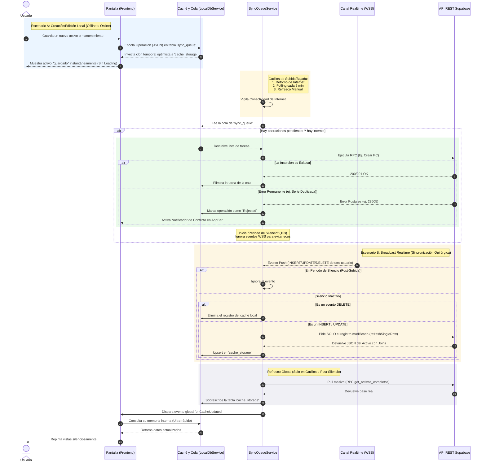
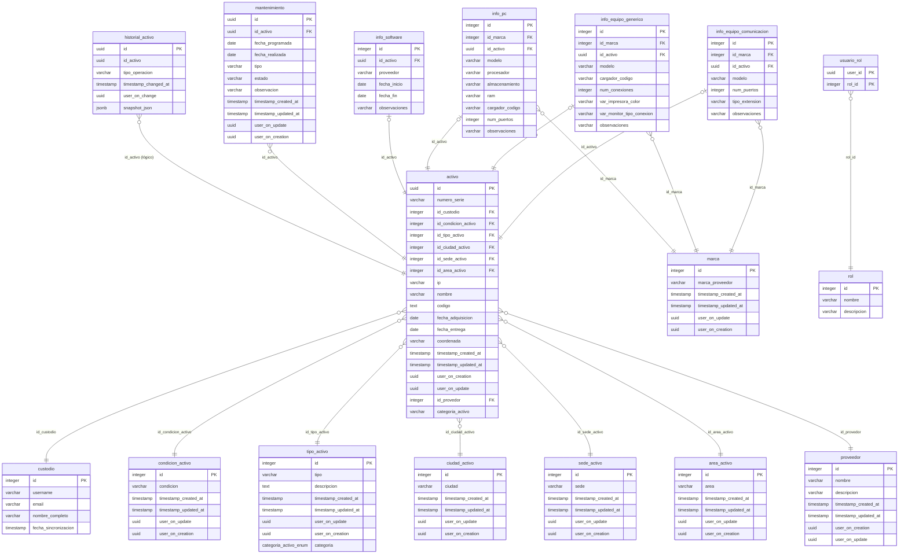

# Diseño e implementación de un sistema de gestión de activos de TI basado en aplicaciones móviles y servicios en la nube


Este proyecto aborda la necesidad crítica de mantener un control preciso sobre el inventario tecnológico corporativo en entornos con conectividad inestable. A través de una arquitectura offline-first, integra lectura de códigos QR, georeferenciación y control de acceso basado en roles para asegurar la trazabilidad y mantenimiento de cada activo de TI en cualquier circunstancia.

## Interfaz de Usuario y Flujos Principales

<p align="center">
  
  
  
  
</p>

## Características Principales

*   **Offline-First:** Sincronización transparente con cola de peticiones locales.
*   **Georeferenciación:** Mapas GPS en tiempo real para ubicación de activos.
*   **Hardware Integrado:** Lector QR y validación por Biometría.
*   **Seguridad:** Control de accesos RBAC (Administrador, TI, Préstamo).

---

## Guía de Inicio Rápido

### Requisitos Previos
*   [Flutter SDK](https://docs.flutter.dev/get-started/install) (Versión 3.19 o superior recomendada).
*   Un proyecto activo en [Supabase](https://supabase.com/).
*   Dispositivo Android físico (Recomendado para pruebas de Cámara, Biometría y GPS).

### Instalación
1.  Clona este repositorio:
    ```bash
    git clone https://github.com/tu-usuario/front_inventarios.git
    ```
2.  Instala las dependencias:
    ```bash
    flutter pub get
    ```
3.  Configura el archivo `.env` en la raíz del proyecto (Nunca subas este archivo a repositorios públicos):
    ```env
    SUPABASE_URL=tu_url_de_supabase
    SUPABASE_ANON_KEY=tu_anon_key
    ```
4.  Ejecuta la aplicación:
    ```bash
    flutter run --release
    ```

---

## Arquitectura de Software y Decisiones Técnicas

### Stack Tecnológico
*   **Frontend**: Flutter (Dart).
*   **Almacenamiento Local (Caché y Cola)**: SQLite (`sqflite`) implementado como un patrón "Document Store" para evitar un esquema relacional complejo en el dispositivo.
*   **Backend as a Service (BaaS)**: Supabase (Autenticación, Base de Datos y WebSockets Realtime).
*   **Base de Datos Central**: PostgreSQL con funciones RPC nativas para delegar la carga de consultas complejas.

### Sincronización Offline-First (The Engine)
El corazón de la aplicación es el `SyncQueueService` y el `LocalDbService`, los cuales operan en conjunto para abstraer la inestabilidad de red de la interfaz de usuario.

*   **Arquitectura Local "Document Store"**: En lugar de replicar las 20+ tablas relacionales en el móvil, SQLite utiliza solo dos tablas planas: `cache_storage` (colección, id, json_data) para lecturas ultrarrápidas, y `sync_queue` para almacenar intenciones de escritura pendientes.
*   **Actualizaciones Optimistas (Optimistic UI)**: Cuando el usuario crea o edita un activo sin conexión, la petición se encola con un UUID v4 seguro. Inmediatamente, la base de datos local "simula" la respuesta del servidor inyectando un clon (Fake Row con Joins) en la caché. La interfaz gráfica se actualiza al instante sin tiempos de carga (Spinners).
*   **Sincronización Quirúrgica mediante Realtime**: El demonio escucha continuamente el canal WebSocket de Supabase. Si otro dispositivo modifica un activo, el móvil intercepta el cambio y descarga **solo** ese registro específico (`refreshSingleRow`), optimizando radicalmente el ancho de banda.
*   **Resolución de Conflictos y Silencio de Red**: Supabase actúa como la fuente de la verdad (Last Writer Wins). Si ocurre un error permanente en la subida (ej. violación de serie única, error 23505), la cola lo marca como "Rechazado" y notifica al usuario en la UI. Al descargar su propia cola, el teléfono activa un "Periodo de Silencio" temporal (10s) ignorando eventos WebSocket para no atrapar ecos de sus propias escrituras.
*   **Ahorro de Batería (Polling)**: La integridad global de los datos se verifica automáticamente cada 5 minutos en segundo plano, balanceando datos frescos y rendimiento energético.


```mermaid
sequenceDiagram
    autonumber
    
    actor Usuario
    participant UI as Pantalla (Frontend)
    participant SQLite as Caché y Cola (LocalDbService)
    participant Daemon as SyncQueueService
    participant SupabaseWSS as Canal Realtime (WSS)
    participant Supabase as API REST Supabase

    rect rgb(235, 245, 255)
        note right of Usuario: Escenario A: Creación/Edición Local (Offline u Online)
        Usuario->>UI: Guarda un nuevo activo o mantenimiento
        UI->>SQLite: Encola Operación (JSON) en tabla 'sync_queue'
        SQLite-->>UI: Inyecta clon temporal optimista a 'cache_storage'
        UI-->>Usuario: Muestra activo "guardado" instantáneamente (Sin Loading)
    end
    
    rect rgb(255, 248, 225)
        note right of Daemon: Gatillos de Subida/Bajada:<br/>1. Retorno de Internet<br/>2. Polling cada 5 min<br/>3. Refresco Manual
        Daemon->>Daemon: Vigila Conectividad de Internet
    end

    Daemon->>SQLite: Lee la cola de 'sync_queue'
    
    alt Hay operaciones pendientes Y hay internet
        rect rgb(234, 250, 234)
            SQLite-->>Daemon: Devuelve lista de tareas
            Daemon->>Supabase: Ejecuta RPC (Ej. Crear PC)
            
            alt La Inserción es Exitosa
                Supabase-->>Daemon: 200/201 OK
                Daemon->>SQLite: Elimina la tarea de la cola
            else Error Permanente (ej. Serie Duplicada)
                Supabase-->>Daemon: Error Postgres (ej. 23505)
                Daemon->>SQLite: Marca operación como "Rejected"
                Daemon->>UI: Activa Notificador de Conflicto en AppBar
            end
        end
        note over Daemon: Inicia "Periodo de Silencio" (10s)<br/>Ignora eventos WSS para evitar ecos
    end
    
    rect rgb(253, 246, 227)
        note right of SupabaseWSS: Escenario B: Broadcast Realtime (Sincronización Quirúrgica)
        SupabaseWSS-->>Daemon: Evento Push (INSERT/UPDATE/DELETE de otro usuario)
        
        alt En Periodo de Silencio (Post-Subida)
            Daemon->>Daemon: Ignora el evento
        else Silencio Inactivo
            alt Es un evento DELETE
                Daemon->>SQLite: Elimina el registro del caché local
            else Es un INSERT / UPDATE
                Daemon->>Supabase: Pide SOLO el registro modificado (refreshSingleRow)
                Supabase-->>Daemon: Devuelve JSON del Activo con Joins
                Daemon->>SQLite: Upsert en 'cache_storage'
            end
        end
    end
    
    rect rgb(240, 240, 245)
        note right of Daemon: Refresco Global (Solo en Gatillos o Post-Silencio)
        Daemon->>Supabase: Pull masivo (RPC get_activos_completos)
        Supabase-->>Daemon: Devuelve base real
        Daemon->>SQLite: Sobrescribe la tabla 'cache_storage'
    end
    
    Daemon->>UI: Dispara evento global 'onCacheUpdated'
    UI->>SQLite: Consulta su memoria interna (Ultra-rápido)
    SQLite-->>UI: Retorna datos actualizados
    UI-->>Usuario: Repinta vistas silenciosamente
```


### Módulos Críticos y Seguridad
*   **Autenticación y Seguridad Multinivel**: Uso de `local_auth` para integración con Face ID y Huella Dactilar del dispositivo. El sistema guarda un hash local de la sesión para desbloqueos ultrarrápidos. Incluye recuperación de clave por `Deep Linking` (Email Mágico de Supabase).
*   **Control de Accesos (RBAC)**: Segregación estricta de responsabilidades:
    *   **`ADMIN`**: Acceso total. Gestión de equipos, creación de usuarios y roles.
    *   **`TI`**: Acceso operativo. Crea/edita activos y gestiona mantenimientos.
    *   **`PRESTAMO`**: Modo lectura/edición superficial. Paneles de creación bloqueados.
*   **Escaneo QR e Inventariado Veloz**: Uso de `mobile_scanner` para lectura directa de números de serie y códigos QR por cámara, agilizando auditorías de hardware.
*   **Georeferenciación**: Integración de `geolocator` para obtener coordenadas exactas en la captura del activo y visualización en `flutter_map` (OpenStreetMap).
*   **Tutorial de Onboarding**: Flujo inicial validado por la bandera local `has_seen_onboarding`. Uso estricto de assets PNG optimizados con `cacheWidth` para evitar los picos de RAM (y colapsos ANR) que provocaban imágenes pesadas.

### Modelo de Datos Polimórfico y Auditoría

La base de datos fue diseñada con un enfoque polimórfico y trazabilidad estricta. 

**Estructura General (Núcleo y Satélites)**: 
Existe una tabla núcleo (`activo`) que centraliza las propiedades universales que todo equipo posee (número de serie, ubicación, custodio, fechas). Dependiendo de la categoría del activo (`categoria_activo_enum`), el sistema se apoya en "tablas satélite" con relación 1:1 (`info_pc`, `info_comunicacion`, `info_software`, `info_equipo_generico`) para almacenar los metadatos específicos sin generar columnas nulas innecesarias en la tabla principal.

**Variables de Auditoría Estricta**:
Todas las tablas maestras y transaccionales incluyen columnas críticas de auditoría:
*   `timestamp_created_at` / `timestamp_updated_at`: Marcas de tiempo manejadas automáticamente.
*   `user_on_creation` / `user_on_update`: Almacenan el UUID del usuario exacto que realizó la acción.
*   Sumado a esto, existe la tabla `historial_activo` que guarda un "snapshot" JSON de cualquier registro antes de ser modificado, garantizando que ninguna operación destructiva pase desapercibida.

**Políticas de Roles y Seguridad**:
La tabla `usuario_rol` sirve de puente vinculante entre las cuentas oficiales de autenticación (`auth.users` de Supabase) y nuestra tabla local `rol`. Esto permite que toda la aplicación implemente RBAC (Control de Acceso Basado en Roles) en la capa de interfaz, y sirve como ancla para establecer políticas RLS (Row Level Security) directamente a nivel de base de datos.

Para evitar que el teléfono móvil tenga que ejecutar complejas consultas `JOIN` de todas estas relaciones, se delegó la carga computacional al servidor empleando **RPCs (Remote Procedure Calls)** como `get_activos_completos`, que devuelven estructuras JSON planas ultrarrápidas listas para ser guardadas en la caché de SQLite.

> **Nota para Auditoría**: El script SQL completo con la declaración de toda la base de datos (tablas, relaciones, enumeradores y funciones RPC) ha sido exportado y se encuentra versionado en la ruta `supabase/migrations/20260513225850_remote_schema.sql`.


```mermaid
erDiagram
    %% Tablas Principales
    activo {
        uuid id PK
        varchar numero_serie
        integer id_custodio FK
        integer id_condicion_activo FK
        integer id_tipo_activo FK
        integer id_ciudad_activo FK
        integer id_sede_activo FK
        integer id_area_activo FK
        varchar ip
        varchar nombre
        text codigo
        date fecha_adquisicion
        date fecha_entrega
        varchar coordenada
        timestamp timestamp_created_at
        timestamp timestamp_updated_at
        uuid user_on_creation
        uuid user_on_update
        integer id_provedor FK
        varchar categoria_activo
    }

    %% Catálogos y Referencias de Activos
    area_activo {
        integer id PK
        varchar area
        timestamp timestamp_created_at
        timestamp timestamp_updated_at
        uuid user_on_update
        uuid user_on_creation
    }

    ciudad_activo {
        integer id PK
        varchar ciudad
        timestamp timestamp_created_at
        timestamp timestamp_updated_at
        uuid user_on_update
        uuid user_on_creation
    }

    condicion_activo {
        integer id PK
        varchar condicion
        timestamp timestamp_created_at
        timestamp timestamp_updated_at
        uuid user_on_update
        uuid user_on_creation
    }

    custodio {
        integer id PK
        varchar username
        varchar email
        varchar nombre_completo
        timestamp fecha_sincronizacion
    }

    proveedor {
        integer id PK
        varchar nombre
        varchar descripcion
        timestamp timestamp_created_at
        timestamp timestamp_updated_at
        uuid user_on_creation
        uuid user_on_update
    }

    sede_activo {
        integer id PK
        varchar sede
        timestamp timestamp_created_at
        timestamp timestamp_updated_at
        uuid user_on_update
        uuid user_on_creation
    }

    tipo_activo {
        integer id PK
        varchar tipo
        text descripcion
        timestamp timestamp_created_at
        timestamp timestamp_updated_at
        uuid user_on_update
        uuid user_on_creation
        categoria_activo_enum categoria
    }

    marca {
        integer id PK
        varchar marca_proveedor
        timestamp timestamp_created_at
        timestamp timestamp_updated_at
        uuid user_on_update
        uuid user_on_creation
    }

    %% Extensiones Polimórficas (1 a 1)
    info_equipo_comunicacion {
        integer id PK
        integer id_marca FK
        uuid id_activo FK
        varchar modelo
        integer num_puertos
        varchar tipo_extension
        varchar observaciones
    }

    info_equipo_generico {
        integer id PK
        integer id_marca FK
        uuid id_activo FK
        varchar modelo
        varchar cargador_codigo
        integer num_conexiones
        varchar var_impresora_color
        varchar var_monitor_tipo_conexion
        varchar observaciones
    }

    info_pc {
        integer id PK
        integer id_marca FK
        uuid id_activo FK
        varchar modelo
        varchar procesador
        varchar almacenamiento
        varchar ram
        varchar cargador_codigo
        integer num_puertos
        varchar observaciones
    }

    info_software {
        integer id PK
        uuid id_activo FK
        varchar proveedor
        date fecha_inicio
        date fecha_fin
        varchar observaciones
    }

    %% Operaciones e Historial
    mantenimiento {
        uuid id PK
        uuid id_activo FK
        date fecha_programada
        date fecha_realizada
        varchar tipo
        varchar estado
        varchar observacion
        timestamp timestamp_created_at
        timestamp timestamp_updated_at
        uuid user_on_update
        uuid user_on_creation
    }

    historial_activo {
        uuid id PK
        uuid id_activo
        varchar tipo_operacion
        timestamp timestamp_changed_at
        uuid user_on_change
        jsonb snapshot_json
    }

    %% Autenticación y Roles
    rol {
        integer id PK
        varchar nombre
        varchar descripcion
    }

    usuario_rol {
        uuid user_id PK
        integer rol_id PK
    }

    %% ================= Relaciones =================
    
    %% Activo -> Catálogos
    activo }o--|| custodio : "id_custodio"
    activo }o--|| condicion_activo : "id_condicion_activo"
    activo }o--|| tipo_activo : "id_tipo_activo"
    activo }o--|| ciudad_activo : "id_ciudad_activo"
    activo }o--|| sede_activo : "id_sede_activo"
    activo }o--|| area_activo : "id_area_activo"
    activo }o--|| proveedor : "id_provedor"

    %% Tablas Satélite (Polimorfismo 1:1) -> Activo
    info_equipo_comunicacion |o--|| activo : "id_activo"
    info_equipo_comunicacion }o--|| marca : "id_marca"

    info_equipo_generico |o--|| activo : "id_activo"
    info_equipo_generico }o--|| marca : "id_marca"

    info_pc |o--|| activo : "id_activo"
    info_pc }o--|| marca : "id_marca"

    info_software |o--|| activo : "id_activo"

    %% Operativos -> Activo
    mantenimiento }o--|| activo : "id_activo"
    historial_activo }o--|| activo : "id_activo (lógico)"
    
    %% Roles
    usuario_rol }o--|| rol : "rol_id"
```


### Arquitectura de navegacion

El flujo visual de la aplicación está centralizado en el componente `MainPage`, el cual actúa como un **Contenedor Principal de Navegación** gestionando de forma eficiente el ciclo de vida de las vistas internas sin recargar el contexto global.

*   **Gestión de Estado Reactiva**: Se emplean `ValueListenableBuilder` acoplados a los *notifiers* del `SyncQueueService` (`hasSyncErrorsNotifier`, `isOnlineNotifier`, `isSyncingNotifier`). Esto permite que elementos globales (como el ícono de la nube o las alertas rojas en el AppBar) se redibujen de forma atómica y en tiempo real sin obligar a la pantalla completa a reconstruirse (`setState`).
*   **Enrutamiento Interno (Indexed Stack Pattern)**: En lugar de usar complejas pilas de navegación (`Navigator.push`), el núcleo operativo intercambia componentes dentro del mismo `Scaffold` usando un índice numérico (`currentPageIndex`). Esto permite cambiar instantáneamente entre el Dashboard, el Gestor de Activos y las Tablas de Mantenimiento. Las páginas específicas de creación o escaneo usan navegación tradicional sobre este andamio base.
*   **Dashboard Inteligente (`_HomePage`)**: Es la vista inicial que evalúa automáticamente la conectividad. Si el teléfono tiene internet, consulta las estadísticas directo a Supabase. Si está *Offline*, delega la consulta a `LocalDbService` devolviendo datos de la caché, ocultando toda esta complejidad técnica al usuario detrás de un simple *Loader*.
*   **Aislamiento Basado en Roles (UI Security)**: Las pantallas leen directamente `RoleService.currentRole`. Si un rol `PRESTAMO` intenta forzar el acceso a configuraciones administrativas (ej. `AdminUsersPage` o `MaintenancePage`), el renderizador reemplaza el árbol de widgets por una vista de "Acceso Denegado", previniendo cualquier escalamiento de privilegios desde la UI.
*   **Gestión de Sesión y Cuenta (SideMenu & UserInfoWidget)**: El perfil del usuario ("Pantalla Cuenta") está integrado como un componente modular directamente en el encabezado del menú lateral de navegación (`SideMenu`). Extrae de forma asíncrona los metadatos del usuario desde Supabase (`full_name`) y genera un `RoleBadge` dinámico según el nivel de permisos. Al ejecutar la acción de "Cerrar Sesión", la arquitectura integra la navegación con la limpieza de estado de forma estricta: antes de hacer `Navigator.pushReplacement` hacia el Login, el sistema ejecuta un `LocalDbService.instance.clearAll()`. Esto garantiza que la base de datos SQLite (caché local) se purgue por completo, evitando fugas de información y asegurando que un nuevo usuario en el mismo dispositivo no cargue datos persistidos de la sesión anterior.

```mermaid
graph TD
    %% Definición de colores basados en tu imagen original
    classDef login fill:#f5f5f5,stroke:#333,stroke-width:1px
    classDef main fill:#bbdefb,stroke:#1976d2,stroke-width:2px
    classDef admin fill:#c8e6c9,stroke:#388e3c,stroke-width:1px
    classDef scanner fill:#ffcdd2,stroke:#d32f2f,stroke-width:1px
    classDef module fill:#ffe0b2,stroke:#f57c00,stroke-width:1px
    classDef form fill:#e1bee7,stroke:#7b1fa2,stroke-width:1px

    %% Nodos de Inicio
    AppStart((Inicio de App))
    AuthCheck{¿Sesión?}
    
    Login["Página de Login<br>(Auth / Supabase)"]:::login
    LockScreen["Pantalla de Bloqueo<br>(Protección Local PIN)"]:::login
    Onboarding["Onboarding<br>(Guía Inicial)"]:::login
    
    MainPage["Main Page<br>(Contenedor Principal + Drawer)"]:::main
    
    %% Flujo de Autenticación
    AppStart --> AuthCheck
    AuthCheck -->|No| Login
    AuthCheck -->|Sí| LockScreen
    
    Login -->|Éxito 1er Ingreso| Onboarding
    Login -->|Éxito| MainPage
    Onboarding --> MainPage
    LockScreen -->|Pin Correcto| MainPage

    %% Nodos Principales (Drawer)
    AdminTablas["Administración<br>Tablas Maestras"]:::admin
    AdminUsuarios["Administración<br>Usuarios"]:::admin
    Mantenimientos["Mantenimientos<br>(MaintenancePage)"]:::admin
    GestionGlobal["Gestión Global de Activos<br>(AssetManagementPage)"]:::admin
    Dashboard["Panel de Control<br>(Dashboard Inicial)"]:::main
    
    MainPage -->|Solo Admin| AdminTablas
    MainPage -->|Solo Admin| AdminUsuarios
    MainPage -->|Admin / TI| Mantenimientos
    MainPage --> GestionGlobal
    MainPage --> Dashboard
    
    %% Nodos de Escáner y Búsqueda
    EscanerQR["Escáner QR/Código Barras<br>(BarcodeScannerScreen)"]:::scanner
    BusquedaRapida["Búsqueda Rápida<br>(QuickSearchResultPage)"]:::scanner
    
    Dashboard --> EscanerQR
    EscanerQR --> BusquedaRapida
    
    %% Módulos de Activos
    ModPC["Módulo PCs<br>(PcAssetsPage)"]:::module
    ModComms["Módulo Comunicaciones<br>(CommsAssetsPage)"]:::module
    ModSoft["Módulo Software<br>(SoftwareAssetsPage)"]:::module
    ModGen["Módulo Genérico<br>(GenericAssetsPage)"]:::module
    
    Dashboard --> ModPC
    Dashboard --> ModComms
    Dashboard --> ModSoft
    Dashboard --> ModGen
    
    %% Flujo de Gestión de Datos
    AssetDetail["Detalle del Activo<br>(AssetDetailPage)"]:::form
    Formulario["Formulario Dinámico<br>(DynamicAssetForm)"]:::form
    
    BusquedaRapida --> AssetDetail
    GestionGlobal --> AssetDetail
    ModPC --> AssetDetail
    ModComms --> AssetDetail
    ModSoft --> AssetDetail
    ModGen --> AssetDetail
    
    AssetDetail -->|Editar| Formulario
    GestionGlobal -.->|Crear Activo| Formulario
    ModPC -.->|Crear| Formulario
    ModComms -.->|Crear| Formulario
    ModSoft -.->|Crear| Formulario
    ModGen -.->|Crear| Formulario
    
    %% Nodos Hijos del Formulario
    VisorMapas["Visor de Mapas<br>(MapDialog / MapScreen)"]:::form
    EscanerInputs["Escáner de Inputs<br>(BarcodeScannerScreen)"]:::scanner
    
    Formulario --> VisorMapas
    Formulario --> EscanerInputs

`

### Interacción y Flujo del Usuario

El diagrama superior ilustra cómo la aplicación evita crear pilas infinitas de navegación y organiza las pantallas de manera modular:

1.  **Arranque y Seguridad (Auth Flow)**: El usuario inicia en la validación de sesión. Si es su primera vez, pasa por el **Login** y el **Onboarding**. Si ya tiene sesión, el sistema exige un PIN o biometría en la **Pantalla de Bloqueo** antes de inyectarlo en el contenedor seguro.
2.  **El Hub Central (MainPage)**: Actúa como el esqueleto inmutable de la app. A través del **Menú Lateral (Drawer)**, el usuario intercambia la vista central de forma instantánea (IndexedStack) entre el **Dashboard** (métricas y accesos rápidos), la **Gestión Global** (tabla maestra de equipos), la vista de **Mantenimientos** y, si tiene permisos de administrador, los paneles de configuración de **Tablas Maestras** y **Usuarios**.
3.  **Profundidad por Módulos**: Desde el Dashboard, los usuarios pueden ingresar a contenedores especializados (**Módulos PCs, Software, etc.**), diseñados para mostrar únicamente las columnas relevantes a la naturaleza de esos activos polimórficos.
4.  **Atajos Transversales (Escáner y Búsqueda)**: El flujo más común para los auditores. Desde el Dashboard, activan el **Escáner QR**, el cual intercepta el código y navega directamente a la vista de **Búsqueda Rápida** y, consecuentemente, al **Detalle del Activo**. Este atajo reduce drásticamente el número de clics para identificar hardware en campo.
5.  **Formularios y Módulos de Apoyo**: La creación o edición detona el **Formulario Dinámico**, el cual no es una pantalla simple, sino un controlador que sub-invoca flujos adicionales como el **Visor de Mapas** (para asentar coordenadas GPS) o el **Escáner de Inputs** (para leer MAC Addresses o Números de Serie directamente con la cámara dentro del formulario).
``


---


---

## Post-Mortem Técnico y Retos Resueltos

A lo largo del desarrollo, aplicamos un riguroso estándar de calidad que nos llevó a auditar y refactorizar áreas críticas del código para garantizar un nivel de producción estable:

### 1. Colisiones Silenciosas de IDs (CRÍTICO)
*   **El Problema**: Las operaciones offline en la cola (sync_queue) usaban DateTime.now().millisecondsSinceEpoch como Primary Key. En operaciones masivas o en un mismo frame de UI, se generaban llaves temporales duplicadas, causando que SQLite abortara las peticiones silenciosamente y se perdiera la data del usuario.
*   **La Solución**: Migración completa a identificadores universales seguros empleando la especificación Uuid().v4(), garantizando unicidad estadística absoluta en la caché.

### 2. Fractura de la Arquitectura Offline (CRÍTICO)
*   **El Problema**: Durante las auditorías de código, se descubrió que la pantalla de búsqueda rápida (QuickSearchResultPage) intentaba eliminar activos *directamente* contra la API de Supabase (wait supabase.rpc(...)). Si el dispositivo perdía conexión, la app crasheaba de forma no controlada.
*   **La Solución**: Re-enrutamiento estricto del flujo hacia LocalDbService.instance.enqueueOperation. Ahora las operaciones destructivas (DELETE) se encolan, actúan localmente primero y respetan el estado offline, manteniendo la integridad arquitectónica en todas las vistas.

### 3. Estabilidad de Interfaz (Jank y Rendering)
*   **El Problema (Cuelgues ANR - Signal 3)**: Al arrancar la app con cuentas nuevas (sin caché), los pesados hilos de parseo vectorial de imágenes SVG chocaban con la primera sincronización masiva de datos (JSON decodes), saturando el hilo principal y colgando la app por completo.
*   **La Solución**: Reemplazo total de assets vectoriales pesados por PNGs con restricciones explícitas de memoria RAM en su renderizado (cacheWidth). Además, se envolvió la capa de sincronización en bloques 	ry-catch dentro de colas asíncronas (Future.microtask), liberando el hilo principal de la UI.
*   **Mutaciones Ilegales en Build()**: Se corrigieron antipatrones críticos donde variables de estado, como los cálculos de paginación (_tableCurrentPage.clamp()), se modificaban directamente dentro de las funciones asíncronas del ciclo uild(), previniendo errores de estado inconsistente y ciclos de reconstrucción infinitos.

### 4. Limpieza Estructural y Análisis Estático (Code Smells)
*   **Igualdad de Objetos en Tablas**: En Dart, dos listas idénticas tienen referencias de memoria distintas. Esto provocaba que el AssetDataTable reconstruyera y perdiera las configuraciones de columnas del usuario constantemente. Solucionado declarando constantes inmutables y controlando referencias de memoria.
*   **Eliminación de Código Muerto**: Extracción de clases obsoletas y saneamiento de advertencias del análisis estático (ej. parámetros residuales no utilizados en la carga de vistas de maintenance_page.dart), reforzando los principios DRY (Don't Repeat Yourself).
*   **Aseguramiento Condicional de Roles (UI Leaking)**: Se corrigió una vulnerabilidad visual menor donde ciertos paneles cargaban acciones transaccionales antes de que la seguridad local lograra restringirlas. La lógica se delegó centralmente al RoleService antes de inflar el árbol de widgets, evitando que usuarios de modo lectura (Préstamo) tuvieran accesos efímeros a botones no autorizados.

## Roadmap y Trabajo Futuro

### Panel Web Administrativo
Dentro de la estructura de este repositorio, en el directorio panel_web/, se encuentra una implementación parcial de un **Panel de Administración Web** diseñado para ejecutarse en navegadores de escritorio. Aunque la solución actual se enfoca en la aplicación móvil con capacidades offline-first, este panel sienta las bases técnicas para una futura escalabilidad, donde los administradores y coordinadores de TI podrán visualizar reportes masivos y gestionar la configuración global desde una interfaz de escritorio conectada a la misma base de datos Supabase.

### Mejoras Propuestas a Futuro
*   **Firmas Digitales de Custodia**: Implementar un pad de firma digital nativo en la app móvil para que el usuario firme en la pantalla al momento de recibir o devolver un equipo, generando un certificado en PDF con validez legal.
*   **Notificaciones Push (FCM)**: Integración con Firebase Cloud Messaging para alertar al equipo de TI sobre mantenimientos programados que están por vencer, o notificar a los custodios cuando se les ha asignado un nuevo equipo.
*   **Exportación Avanzada de Reportes**: Generación automática de reportes ejecutivos en formatos Excel/PDF directamente desde la aplicación o el Panel Web para presentar en auditorías.
*   **Auditorías Cíclicas Automatizadas**: Módulo inteligente que cruce las fechas de escaneo y alerte si un activo de alto valor no ha sido verificado visualmente en más de 6 meses.
*   **SSO (Single Sign-On)**: Integración con Microsoft Entra ID (Active Directory) o Google Workspace para que el personal ingrese con sus credenciales corporativas directamente.

---

## Autores y Agradecimientos

Este proyecto integrador fue desarrollado como culminación de estudios académicos, aplicando arquitecturas de software modernas y resolución de problemas del mundo real.

*   **Desarrollador Principal**: Leandro Ilan Coral Morales
*   **Asesor Académico**: Jose David Vega Sánchez, Ph.D.
*   **Contacto**: [leandrocoral.m@gmail.com](mailto:leandrocoral.m@gmail.com)

Agradecimientos especiales al equipo docente y asesores por la orientación técnica durante el desarrollo de esta arquitectura Offline-First.
